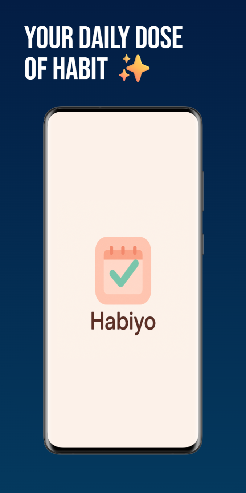
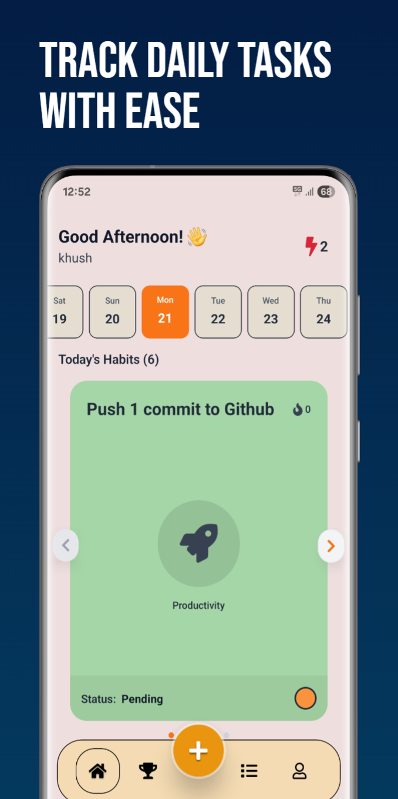
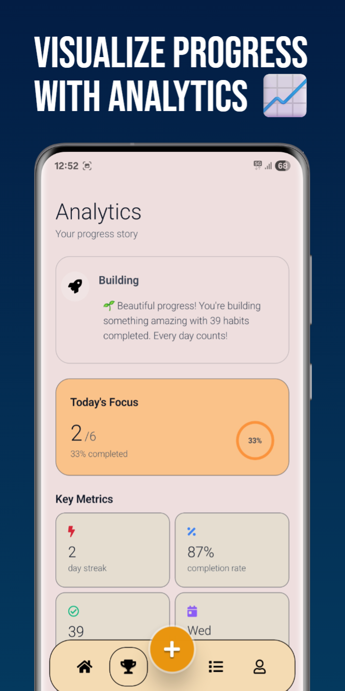
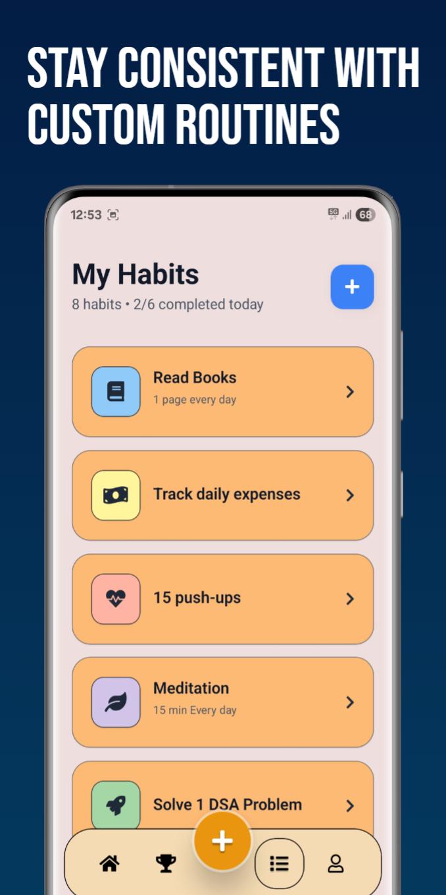
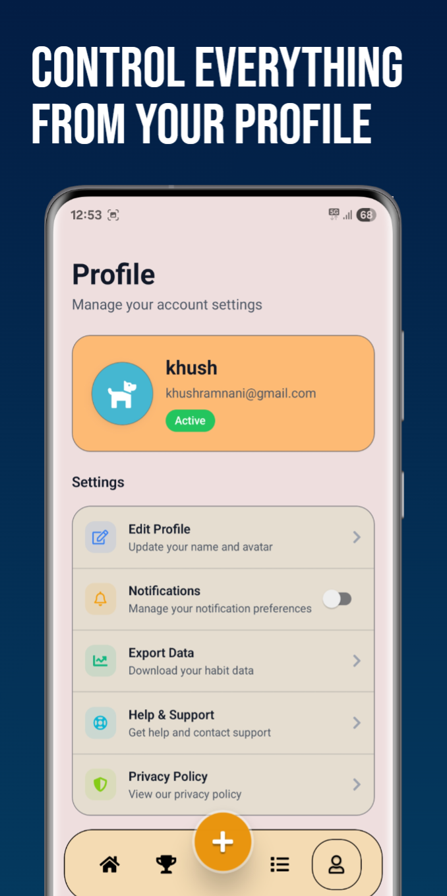
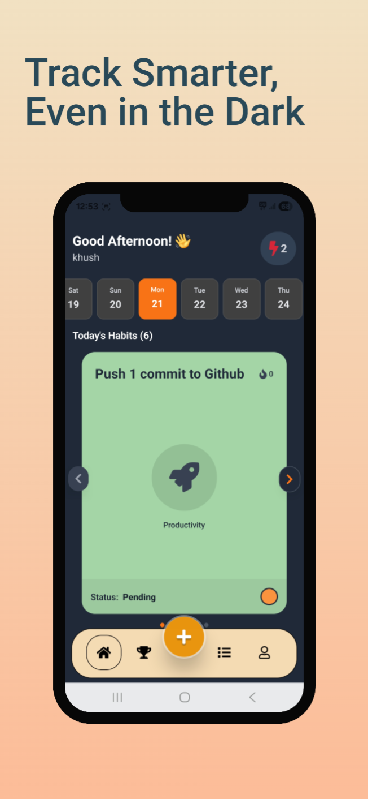
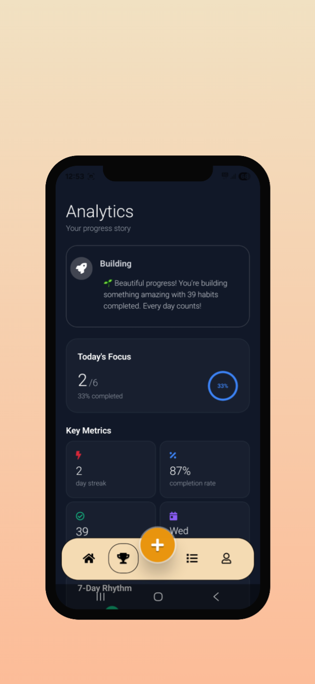
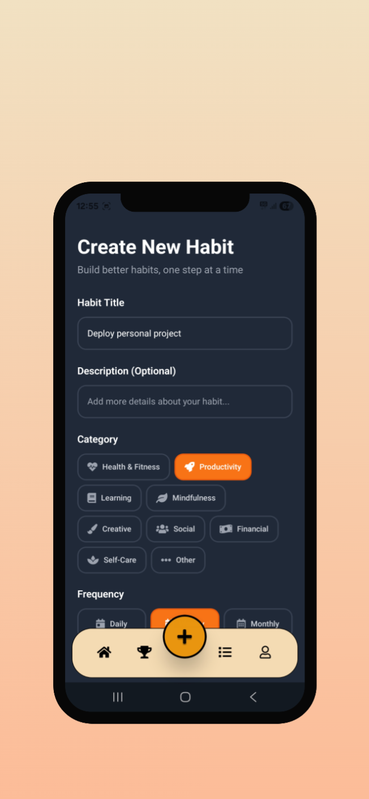
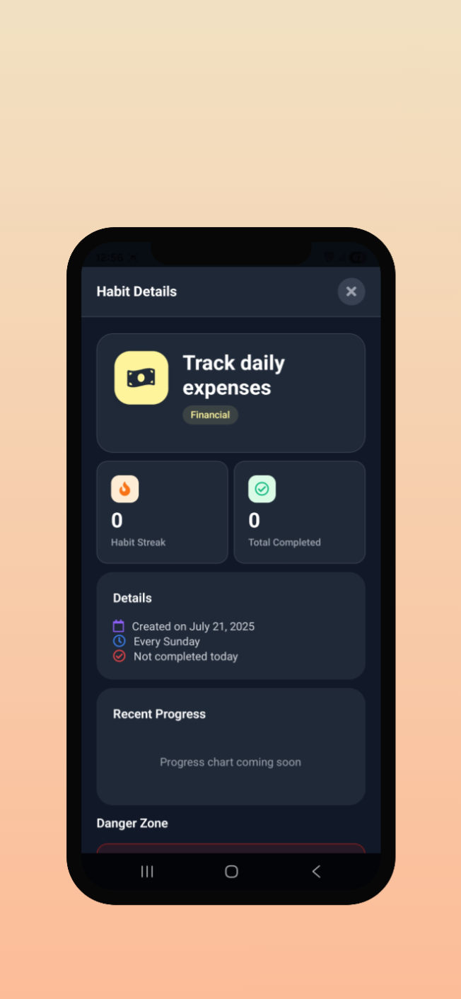
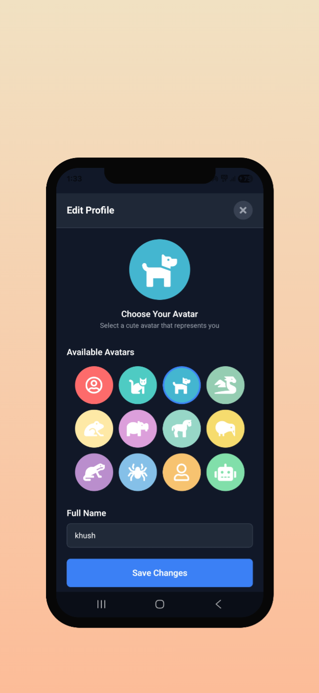

# Habiyo 📱✨

*Your daily dose of discipline.*

Habiyo is a modern, minimalist habit tracking application built with React Native and Expo. Transform your daily routines into lasting habits with beautiful design, smart analytics, and seamless user experience.


## 📋 Table of Contents

- [🌟 Features](#-features)
- [🛠️ Tech Stack](#️-tech-stack)
- [📱 Screenshots](#-screenshots)
- [📥 Download](#-download)
- [🚀 Getting Started](#-getting-started)
- [🏗️ Project Structure](#️-project-structure)
- [🎨 Design Philosophy](#-design-philosophy)
- [🔄 Habit Tracking Logic](#-habit-tracking-logic)
- [🤝 Contributing](#-contributing)
- [🐛 Bug Reports & Feature Requests](#-bug-reports--feature-requests)
- [📄 License](#-license)
- [🔗 Links](#-links)

## 🌟 Features

### 🎯 Core Functionality
- **Smart Habit Creation**: Create habits with flexible frequencies (daily, weekly, monthly)
- **Interactive Calendar**: Beautiful calendar view to track your progress
- **Daily Cards**: Swipeable cards for easy habit completion
- **Real-time Streaks**: Track current and longest streaks automatically
- **Habit Categories**: Organize habits by Health & Fitness, Productivity, Learning, Mindfulness, Creative, Social, and more

### 📊 Analytics & Insights
- **Personal Analytics Dashboard**: Comprehensive overview of your habit journey
- **7-Day Rhythm Visualization**: Bar charts showing weekly completion patterns
- **Completion Rate Tracking**: Monitor your success percentage
- **Motivational Insights**: Personalized messages based on your progress
- **Category Statistics**: See which areas you focus on most
- **Most Productive Day**: Discover your best performance days

### 🎨 User Experience
- **Dark/Light Theme Support**: Adaptive design that follows system preferences
- **Haptic Feedback**: Tactile responses for better interaction
- **Smooth Animations**: Fluid transitions and micro-interactions
- **Pull-to-Refresh**: Keep your data up-to-date effortlessly
- **Responsive Design**: Optimized for all screen sizes

### 🔐 Authentication & Sync
- **Email Authentication**: Secure sign-up and sign-in
- **Google Sign-In**: Quick authentication with Google
- **Cloud Sync**: Your data is safely stored and synced across devices
- **User Profiles**: Personalized experience with custom names and preferences

### ⚡ Performance Features
- **Background App State Handling**: Automatic data refresh when returning to app
- **Date Change Detection**: Smart detection of day changes for accurate tracking
- **Offline-First Design**: Continue using the app even with poor connectivity
- **Optimized Rendering**: Smooth performance with large habit lists

## 🛠️ Tech Stack

### Frontend
- **React Native** (0.79.5) - Cross-platform mobile development
- **Expo** (SDK 53) - Development platform and tools
- **TypeScript** - Type-safe development
- **NativeWind** - Tailwind CSS for React Native
- **Expo Router** - File-based navigation system

### UI/UX
- **FontAwesome5** - Beautiful icons
- **React Native Reanimated** - Smooth animations
- **React Native Gesture Handler** - Touch gestures
- **Expo Haptics** - Tactile feedback
- **React Native Paper** - Material Design components

### Backend & Database
- **Appwrite** - Backend-as-a-Service
  - User authentication
  - Database management
  - Real-time updates
  - Cloud storage

### Development Tools
- **ESLint** - Code linting
- **Prettier** - Code formatting
- **Tailwind CSS** - Utility-first styling
- **EAS Build** - Cloud build service

## 📱 Screenshots

### ☀️ Light Mode
<div style="display: flex; flex-wrap: wrap; gap: 10px; justify-content: center; margin-bottom: 20px;">
  
  
  
  
  
</div>

### 🌙 Dark Mode
<div style="display: flex; flex-wrap: wrap; gap: 10px; justify-content: center; margin-bottom: 20px;">
  
  
  
  
  
</div>


## 📥 Download

### Android
📱 **[Download APK](https://expo.dev/artifacts/eas/3sZmmcydr3ikH2JAMFiSRQ.apk)**

*Click the link above to download the latest Android APK*

### iOS
🍎 **App Store link will be available soon**

*iOS version coming to the App Store*

## 🚀 Getting Started

### Prerequisites
- Node.js (16.x or later)
- npm or yarn
- Expo CLI
- Android Studio (for Android development)
- Xcode (for iOS development, macOS only)

### Installation

1. **Clone the repository**
   ```bash
   git clone https://github.com/khushramnani/Habiyo.git
   cd my-app
   ```

2. **Install dependencies**
   ```bash
   npm install
   # or
   yarn install
   ```

3. **Set up environment variables**
   Create a `.env` file in the root directory:
   ```env
   EXPO_PUBLIC_APPWRITE_ENDPOINT=your_appwrite_endpoint
   EXPO_PUBLIC_APPWRITE_PROJECT_ID=your_project_id
   EXPO_PUBLIC_APPWRITE_DB_ID=your_database_id
   EXPO_PUBLIC_COLLECTION_ID=your_habits_collection_id
   EXPO_PUBLIC_HABIT_LOG_COLLECTION_ID=your_logs_collection_id
   EXPO_PUBLIC_USER_STREAK_COLLECTION_ID=your_streaks_collection_id
   EXPO_PUBLIC_USER_PROFILE_COLLECTION_ID=your_profiles_collection_id
   ```

4. **Start the development server**
   ```bash
   npx expo start
   ```

5. **Run on your device**
   - Install Expo Go app on your phone
   - Scan the QR code from the terminal
   - Or press `a` for Android emulator, `i` for iOS simulator

### Building for Production

```bash
# Build for Android
eas build --platform android

# Build for iOS
eas build --platform ios

# Build for both platforms
eas build --platform all
```

## 🏗️ Project Structure

```
app/
├── (tabs)/                 # Tab-based navigation
│   ├── index.tsx          # Home screen with daily cards
│   ├── AllHabits.tsx      # Habits management
│   ├── AddHabit.tsx       # Create new habits
│   ├── Analytics.tsx      # Analytics dashboard
│   └── UserScreen.tsx     # User profile & settings
├── Components/
│   └── HomeTab/
│       ├── CalendarRow.tsx    # Calendar component
│       ├── DailyCards.tsx     # Swipeable habit cards
│       └── HabitDetailModal.tsx # Habit detail popup
├── context/
│   └── authContext.tsx    # Authentication logic
└── auth.tsx               # Authentication screens

contexts/
├── habitContext.tsx       # Habit management state
├── themeContext.tsx       # Theme management
└── userProfileContext.tsx # User profile state

data/
└── category.json          # Habit categories data

lib/
└── appwrite.ts           # Appwrite configuration
```

## 🎨 Design Philosophy

Habiyo follows a **minimal-first** design approach:

- **Clean Interface**: Distraction-free environment focused on your habits
- **Intuitive Navigation**: Everything is where you expect it to be
- **Consistent Typography**: Clear hierarchy with readable fonts
- **Thoughtful Colors**: Calming palette that promotes focus
- **Micro-interactions**: Subtle animations that provide feedback

## 🔄 Habit Tracking Logic

### Frequency Types
- **Daily**: Habits that should be done every day
- **Weekly**: Choose specific days of the week
- **Monthly**: Select specific dates of the month

### Streak Calculation
- **Current Streak**: Consecutive days of completing all due habits
- **Longest Streak**: Personal best streak record
- **Smart Reset**: Streaks are calculated based on actual due dates

### Completion Tracking
- Habits are marked complete for the current day
- Historical data is preserved for analytics
- Progress is synced across all devices

<!-- ## 🤝 Contributing

We welcome contributions! Here's how you can help:

1. **Fork the repository**
2. **Create a feature branch** (`git checkout -b feature/amazing-feature`)
3. **Commit your changes** (`git commit -m 'Add amazing feature'`)
4. **Push to the branch** (`git push origin feature/amazing-feature`)
5. **Open a Pull Request** -->
<!-- 
### Development Guidelines
- Follow TypeScript best practices
- Use meaningful commit messages
- Test on both iOS and Android
- Ensure accessibility compliance
- Follow the existing code style -->

## 🐛 Bug Reports & Feature Requests

If you encounter any issues or have feature suggestions:

1. **Check existing issues** on GitHub
2. **Create a detailed issue** with:
   - Device and OS version
   - Steps to reproduce
   - Expected vs actual behavior
   - Screenshots if applicable

## 📄 License

This project is licensed under the MIT License - see the [LICENSE](LICENSE) file for details.


## 🔗 Links

- **Repository**: [GitHub](https://github.com/khushramnani/Habito)
- **Issues**: [Report Issues](https://github.com/khushramnani/Habito/issues)
- **Documentation**: [Expo Docs](https://docs.expo.dev/)

---

**Made with ❤️ by [Khush Ramnani](https://github.com/khushramnani)**

*Transform your habits, transform your life.* 🌟
